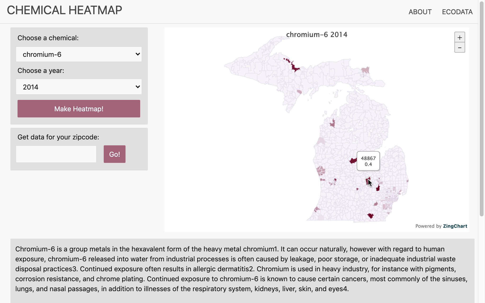

# Chemical Contamination Heatmap
A website that lets users easily view heatmaps of hazardous chemical contaminant levels across the state of Michigan. Try it out at **https://krithikvallem.github.io/Chemical_Contamination_Heatmap/**!

https://user-images.githubusercontent.com/47306032/120421546-7eeb5600-c334-11eb-98a3-dc94f76d551a.mp4

The data for this website was obtained from the EPA by gathering and analyzing 400,000+ publicly available unstructured datapoints. You can check out the repository containing that code at https://github.com/UMEcoData/Michigan-Chemical-Contamination-Heatmaps! 
